# Lim Lab Server Resources

The Lim lab has a server called "casalim" this server is located in one of the server rooms here at Mission bay and provides redundant, reliable network storage for lab research data.

The server capacity is about 50TB and currently contains the data the lab has collected over the last few years. We just upgraded the server to this amount of storage to fit the needs of the lab.

Currently the server is setup running open source software connected to a very large array of disks running the ZFS file system.

The server is setup so that each lab member gets a home folder that is only accessible to that lab member. As well as a folder called "limshared" that has shared files and folders for anyone to access. It is important to not that that folder is "read-writable" to all members of the lab so take care when making changes to that folder.

Please contact (me) Peter Werba if you need any custom folders or permissions I am happy to work with you to make sure that the server is helping you with your research.

# Connecting to the server (MAC)

supported MAC OS (10.6 10.7 10.8 10.9 10.10, 10.11)

## Step One
In the Finder select Connect to Server from the Go menu (command-k).

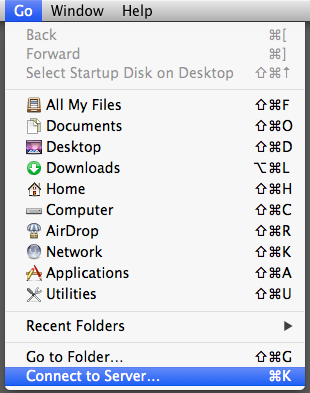

## Step Two

Type in the address of the server:  smb://server.ucsf.edu/folder
NOTE: It is important to use SMB:// before the server address

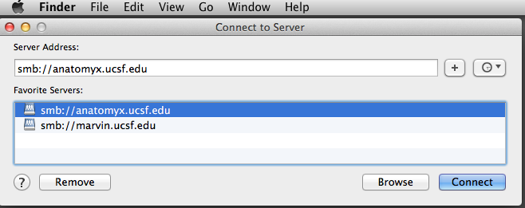

## Step Three

When prompted enter in your UCSF email username and password.
NOTE: this would be the same credentials you use when logging into UCSF webmail.

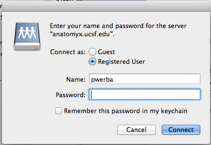

Click the "connect" button

## Step Four

You are now presented with a list of avaliable shares. Choose the share you wish to be connected to and click "OK"

NOTE: You may not have full access to each share that is shown if a sharepoint shows up ad grey it most likey means that you are already connected to the share.

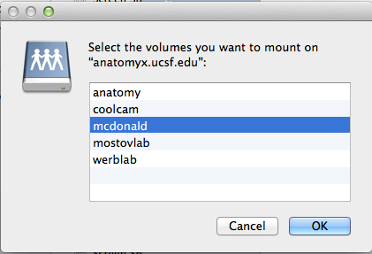

#Connecting to the server (Windows_OS7)

###If your computer is bound to the campus Active Directory

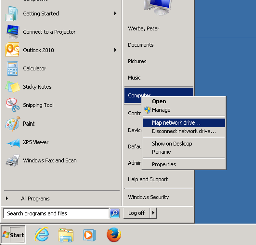

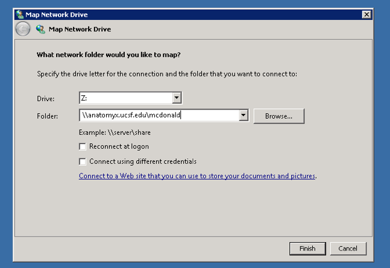

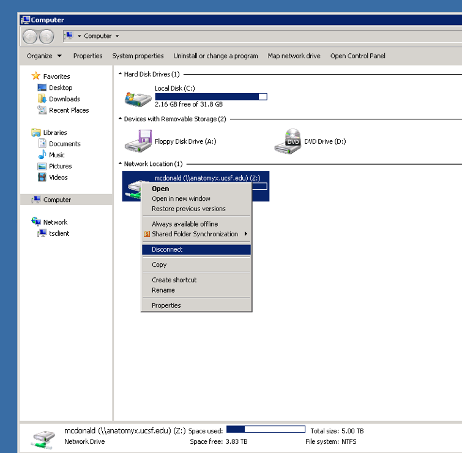

###If your computer is NOT bound to the campus Active Directory

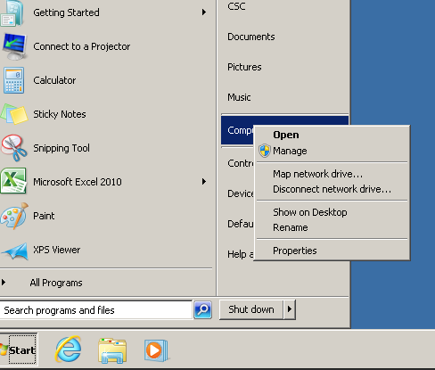

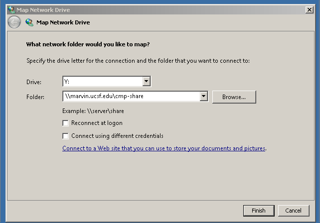

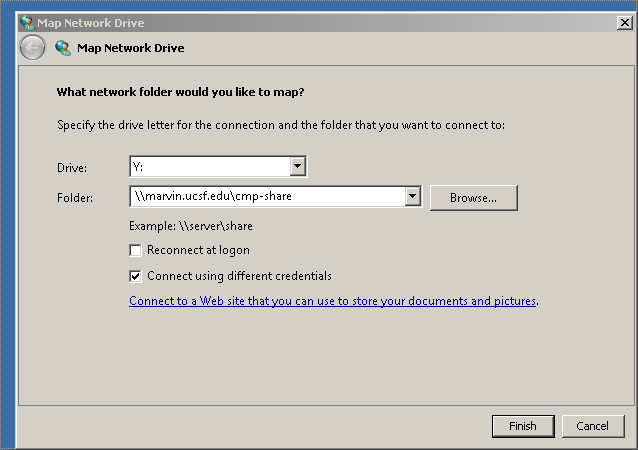

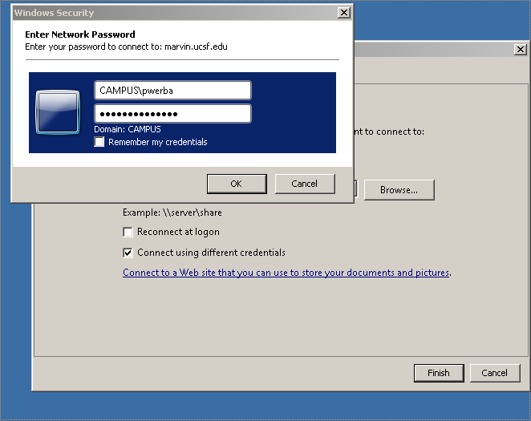

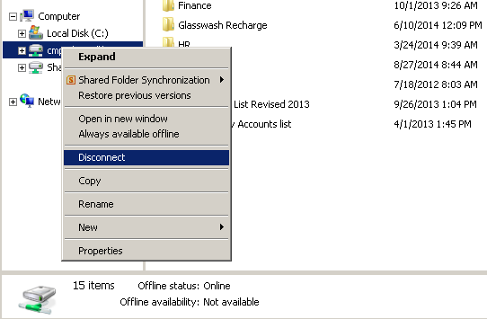

# Connecting to the server (Windows_OS)
### How to connect to cmp file server from Windows OS (Windows XP)

1. Right-click on "My Computer" (note this can vary on the version of windows you are on.. if not on the desktop please look in the "Start" menu.
2. Select the option "map network drive"
3. A window will appear the default drive map will be Z: (*NOTE: you can change this if you wish, it's best to leave the default*)
4. In the field labeled "Folder:" please type the path to the network share that you are trying to connect to eg: `\\servername.ucsf.edu\share_point`
5. Depending on your options either select or deselect the "Reconnect at logon" box (*NOTE: if this is a share you use every day this is a good option.*)
6. If you are not bound to the server or the password differs from your login please choose the option "Connect using a differnet user name" "different user name" is a hyperlink if selected you get a box to type your username and pass into.
7. Type your username and password and then choose "Finish" this will give you access to the share.. you should now see the Z: drive mounted under your computer.

### How to connect to the CMP File Server from Windows OS (VISTA OR WIN7)

NOTE: If you are running Windows Vista or Windows 7 you will have to make the following changes to the Windows Security Policy. The default setup allows you to connect to a bound windows server … Please make the following changes

<code>
Open Control Panel - Administrative Tools - Local Security Policy

Local Policies - Security Options

Network security: LAN Manager authentication level
Send LM &amp; NTLM responses

Minimum session security for NTLM SSP
Disable Require 128-bit encryption
</code>

After you make the following changes you should be able to follow steps 1-7 above and connect to the server.
