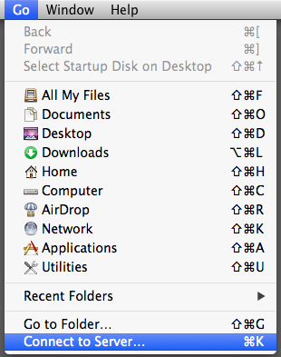

# Connecting to the server
Requirements:

You must be on the Campus network either by connected to ethernet (prefered for large files) or wireless
or from home you must be using UCSF VPN link <https://it.ucsf.edu/services/vpn>

supported MAC OS (10.5, 10.6 10.7 10.8 10.9)

## Step One
In the Finder select Connect to Server from the Go menu (command-k).

## Step Two

Type in the address of the server:  smb://server.ucsf.edu/folder
NOTE: It is important to use SMB:// before the server address

## Step Three

When prompted enter in your UCSF email username and password.
NOTE: this would be the same credentials you use when logging into UCSF webmail.

Click the "connect" button

## Step Four

You are now presented with a list of avaliable shares. Choose the share you wish to be connected to and click "OK"

NOTE: You may not have full access to each share that is shown if a sharepoint shows up ad grey it most likey means that you are already connected to the share.

